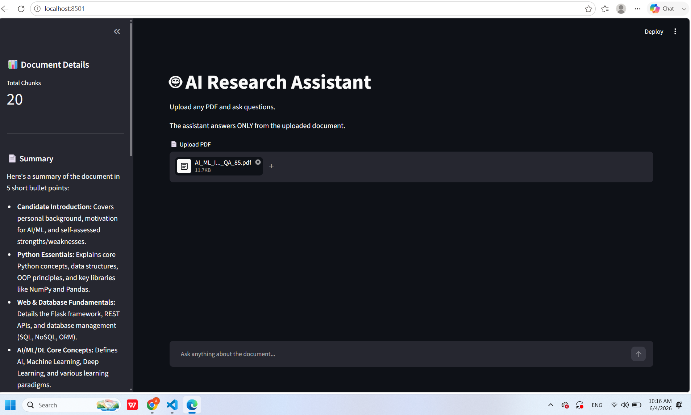
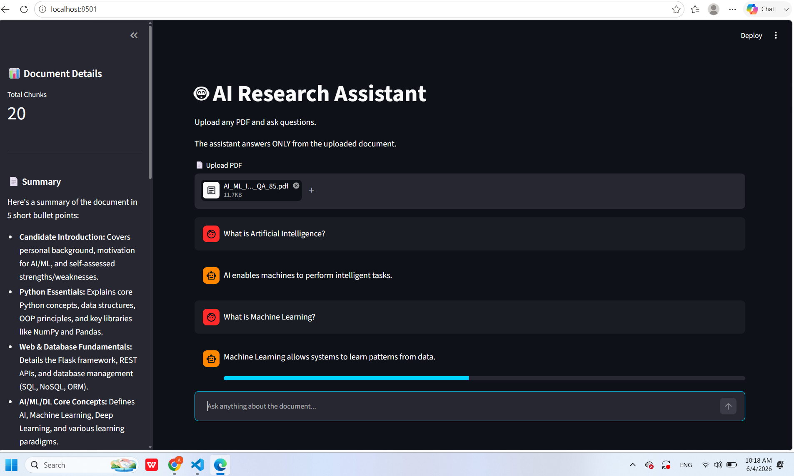

# 🤖 AI Research Assistant (RAG-Based PDF Q&A Bot)

An intelligent Document Question Answering System built using Streamlit, FAISS, Sentence Transformers, and Google Gemini.

The application allows users to upload PDF documents and ask questions based only on the content of the uploaded document.

---

## 🚀 Features

### 📄 PDF Upload
Upload any PDF document.

### 🔍 Intelligent Retrieval
Uses vector embeddings and FAISS similarity search to retrieve relevant document chunks.

### 🤖 Gemini Powered Answers
Answers are generated using Google Gemini 2.5 Flash.

### 🛡 Hallucination Protection
If information is not available in the document, the assistant responds:

> This information is not available in the document.

### 💬 Chat Interface
Modern ChatGPT-style conversation UI.

### 📊 Confidence Score
Displays confidence level for each answer.

### 📚 Source Tracking
Shows retrieved document chunks used to generate the answer.

### 📝 Document Summary
Automatically generates a summary of the uploaded document.

### 🔑 Topic Extraction
Extracts key topics from the uploaded document.

### 🌙 Dark Theme
Professional dark-themed interface.

---

# 🏗 Architecture

```text
PDF Upload
    │
    ▼
PDF Text Extraction
    │
    ▼
Text Chunking
    │
    ▼
Sentence Embeddings
    │
    ▼
FAISS Vector Store
    │
    ▼
Similarity Search
    │
    ▼
Context Retrieval
    │
    ▼
Gemini 2.5 Flash
    │
    ▼
Final Answer
```

---

# 🛠 Tech Stack

- Python
- Streamlit
- Google Gemini 2.5 Flash
- FAISS
- Sentence Transformers
- NumPy
- PyPDF
- Python Dotenv

---

# 📂 Project Structure

```text
azentrix-fullstack-task1/

│
├── app.py
├── chatbot.py
├── vector_store.py
├── pdf_reader.py
├── requirements.txt
├── .env
│
├── .streamlit
│   └── config.toml
│
└── README.md
```

---

# ⚙ Installation

Clone the repository:

```bash
git clone <your-repository-url>
```

Move into project directory:

```bash
cd azentrix-fullstack-task1
```

Create virtual environment:

```bash
python -m venv venv
```

Activate virtual environment:

Windows:

```bash
venv\Scripts\activate
```

Install dependencies:

```bash
pip install -r requirements.txt
```

---

# 🔑 Environment Variable

Create a `.env` file in project root.

```env
GEMINI_API_KEY=YOUR_GEMINI_API_KEY
```

---

# ▶ Run Application

```bash
streamlit run app.py
```

---

# 📸 Screenshots

Add screenshots here:

### Home Page


### PDF Upload



### Question Answering



---

# 🎥 Demo Video

Loom Demo Link:

```text
Paste your Loom URL here
```

---

# 📈 Future Improvements

- Multi-PDF Support
- Citation-Based Answers
- Page Number References
- ChromaDB Integration
- LangChain Integration
- Conversation Memory
- Agentic AI Workflow

---

# 👨‍💻 Author

Ankit Thummar

AI / ML Enthusiast

Python Developer

---

# 📄 License

This project is developed for internship assessment purposes.